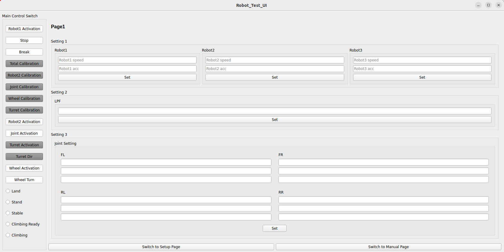
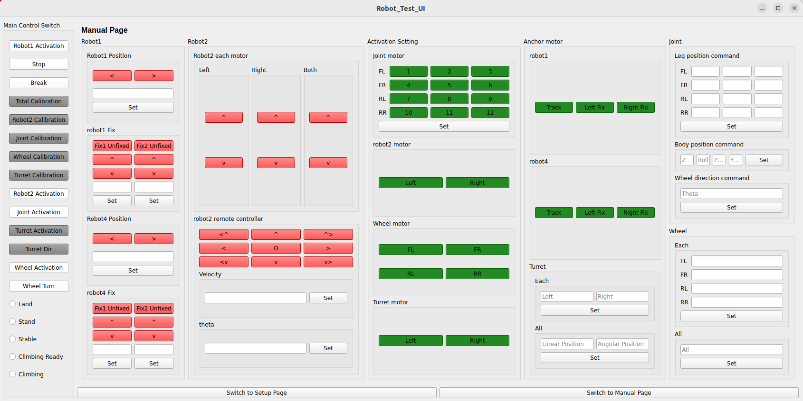

# Robot Control GUI

## Overview

This GUI is a simplified version of the interface used to test our ROS2-based robots. It facilitates easy setup for complex robots as well as conducting simple experiments. The GUI is designed to publish specific topics that your robot's control code can interpret to perform various manipulations. 

Please note that this repository doesn't delve into each function within the UI, as they are specifically tailored to the robot used during development. However, you can easily modify these for your own purposes. The primary functionality revolves around publishing specific topics.




## Installation

To install and set up your environment to use this GUI, follow these steps:

```bash
cd robot_gui_pkg
```

```bash
colcon build
```

```bash
source instll/setup.bash
```

```bash
ros2 run ros2_gui run_ui
```

## Code Structure

```
                                                     Test UI DESCRIPTION
                                                     
        [CLASS]                [PAGE/FUNCTION]                                     [TOPIC NAME]                         

                        
                        
                        
        SetupWindow : Setup Page
                        ㄴ Control Switch
                            ㄴ on_robot1_activation_clicked             : /ui_setup_is_robot1_activation
                            ㄴ on_stop_clicked                          : /ui_setup_is_robot_stop
                            ㄴ on_break_clicked                         : /ui_setup_is_robot_break
                            
                        ㄴ Calibration
                            ㄴ on_total_calibration_clicked             : /ui_setup_is_total_calibration
                            ㄴ on_robot2_calibration_clicked            : /ui_setup_is_robot2_calibration
                            ㄴ on_joint_calibration_clicked             : /ui_setup_is_joint_calibration
                            ㄴ on_wheel_calibration_clicked             : /ui_setup_is_wheel_calibration
                            ㄴ on_turret_calibration_clicked            : /ui_setup_is_turret_calibration
                            
                        ㄴ Motor speed_acc setting
                            ㄴ on_robot1_motor_set_clicked              : /ui_setup_robot1_motor_setting
                            ㄴ on_robot2_motor_set_clicked              : /ui_setup_robot2_motor_setting
                            ㄴ on_joint_motor_set_clicked               : /ui_setup_joint_motor_setting
                            
                        ㄴ Initial Pose
                            ㄴ on_robot_mode_toggled                    : /ui_setup_robot_mode
                            ㄴ on_initial_pose_set_clicked              : /ui_setup_initial_pose

        ManualWindow : Manual Page
                        ㄴ robot1                                       
                            ㄴ on_robot1_position_changed               : /ui_manual_is_robot1_position
                            ㄴ on_anchor_fixed_changed                  : /ui_manual_is_anchor_fixed (not)
 
                        ㄴ robot2
                            ㄴ on_robot2_activation_clicked             : /ui_manual_is_robot2_activation
                            ㄴ on_robot2_each_changed                   : /ui_manual_is_robot2_each
                            ㄴ on_robot2_remote_changed                 : /ui_manual_is_robot2_remote
                            ㄴ on_robot2_remote_vel_clicked             : /ui_manual_robot2_remote_velocity
                            
                        ㄴ Activation Setting
                            ㄴ on_activation_setting_changed            
                                ㄴ get_activation_setting_states        : /ui_manual_is_activation_setting
                            
                        ㄴ Turret
                            ㄴ on_turret_activation_clicked             : /ui_manual_is_turret_activation
                            ㄴ on_turret_dir_clicked                    : /ui_manual_is_turret_dir
                            ㄴ on_turret_set_clicked                    : /ui_manual_turret_velocity_command_each
                            ㄴ on_turret_all_set_clicked                : /ui_manual_turret_velocity_command_all
                            
                        ㄴ Joint
                            ㄴ on_joint_activation_clicked              : /ui_manual_is_joint_activation
                            ㄴ on_leg_position_command_clicked          : /ui_manual_leg_position_command
                            ㄴ on_body_position_command_clicked         : /ui_manual_body_position_command
                            ㄴ on_wheel_direction_command_clicked       : /ui_manual_wheel_direction_command
                            
                        ㄴ Wheel
                            ㄴ on_wheel_activation_clicked              : /ui_manual_is_wheel_activation
                            ㄴ on_wheel_turn_clicked                    : /ui_manual_is_wheel_turn
                            ㄴ on_wheel_each_set_clicked                : /ui_manual_wheel_velocity_command_each
                            ㄴ on_wheel_all_set_clicked                 : /ui_manual_wheel_velocity_command_all

```
